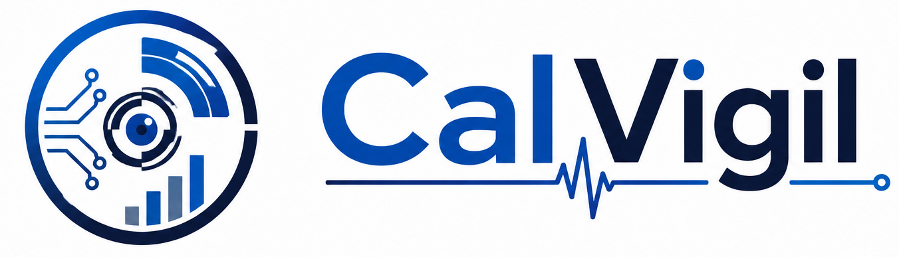

<p align="center">
  
</p>

<p align="center">
  <a href="https://github.com/Calsoft-Pvt-Ltd/calvigil/actions/workflows/ci.yml"></a>
  <a href="https://github.com/Calsoft-Pvt-Ltd/calvigil/actions/workflows/ci.yml"></a>
  <a href="https://github.com/Calsoft-Pvt-Ltd/calvigil/actions/workflows/security-scan.yml"></a>
  <a href="https://github.com/Calsoft-Pvt-Ltd/calvigil/releases/latest"></a>
  <a href="https://github.com/Calsoft-Pvt-Ltd/calvigil/blob/main/LICENSE"></a>
</p>

# calvigil

An open-source, AI-powered vulnerability scanner CLI for **Go**, **Java**, **Python**, **Node.js**, **Rust**, **Ruby**, **PHP**, and **C/C++** projects.

## Features

- **Dependency Scanning** — checks your lock files against multiple CVE databases:
  - [OSV.dev](https://osv.dev) (primary, batch API, no rate limits)
  - [Sonatype OSS Index](https://ossindex.sonatype.org/) (PURL-based, optional with existing/migrated credentials)
  - [NVD](https://nvd.nist.gov/) (NIST National Vulnerability Database)
  - [GitHub Advisory Database](https://github.com/advisories)
  - [CISA KEV](https://www.cisa.gov/known-exploited-vulnerabilities-catalog) enrichment — findings actively exploited in the wild are flagged `⚠ KEV`

- **Canonical Data Model** — every source is normalized into one consistent shape:
  - CVE IDs preferred as the primary identifier (GHSA and ecosystem IDs become aliases)
  - Duplicate findings across databases are **merged**, not dropped — missing severity, CVSS score, or fix version is filled in from whichever source has it
  - OSV ecosystem advisories such as `GO-*` are enriched from their CVE alias when the ecosystem record omits CVSS data
  - NVD exact-CVE enrichment uses resilient `cveIds` lookups with up to 100 CVEs per request, a 2-minute NVD request timeout, controlled keyed parallelism, six-second request pacing, timeout/503 split fallback, backoff, a CalVigil User-Agent, source-aware CVSS selection, and a 24h local CVE cache to fill missing CVSS scores on already-matched findings
  - Severity fallback chain (CVSS v3 → v4 → v2 vector → numeric score → source label) eliminates most `UNKNOWN` severities

- **AI-Powered Code Analysis** — uses OpenAI GPT-4, local Ollama, or LM Studio models to detect OWASP Top 10 vulnerabilities:
  - SQL Injection, Command Injection, XSS
  - Hardcoded secrets & API keys
  - Insecure cryptography, TLS misconfigurations
  - Path traversal, insecure deserialization
  - CORS misconfiguration, and more
  - **Provider choice**: `--provider openai`, `--provider ollama`, `--provider lmstudio`, or `--provider auto` (default)

- **Local LLM Support — Ollama & LM Studio Integration**:
  - Run AI analysis entirely offline with models like `llama3`, `codellama`, `mistral`
  - **Ollama**: OpenAI-compatible API with native Ollama fallback
  - **LM Studio**: OpenAI-compatible API at `http://localhost:1234/v1`
  - Auto-detection: if Ollama is reachable it's preferred, then LM Studio, otherwise OpenAI
  - Configure via CLI flags (`--ollama-url`, `--ollama-model`, `--lmstudio-url`, `--lmstudio-model`) or config/env vars

- **License Compliance Scanning**:
  - Detect and classify licenses from package metadata (SPDX identifiers)
  - **Standalone `scan-license` command** — lightweight, no API keys or vuln DBs required
  - **License resolver** queries deps.dev, PyPI, npm, and RubyGems registries for missing license data; PyPI resolution prefers version-specific `license_expression` metadata, then legacy license fields, normalized classifiers, and canonical full license text
  - Regular JSON scans enrich package inventory licenses before reporting or Enterprise push
  - **SPDX compound expression support**: handles `OR` (most permissive), `AND` (most restrictive), and `WITH` (exception) clauses
  - Comprehensive SPDX license database (~480 permissive + ~130 copyleft identifiers)
  - Flags copyleft licenses (GPL, AGPL, LGPL, MPL) that may require source disclosure
  - Flags unknown/unrecognized licenses for manual review
  - Enable with `--check-licenses` flag (integrated scan) or use `scan-license` (standalone)
  - Filter by risk level with `--risk copyleft` or `--risk unknown`
  - License-only reports hide vulnerability sections for focused compliance audits

- **Offline Vulnerability Cache**:
  - File-based cache for vulnerability query results (~/.calvigil/cache/)
  - Configurable TTL (default 24h) via `--cache-ttl`
  - Dramatically speeds up repeated scans of the same project
  - Disable with `--no-cache` flag

- **Supply Chain Protection**:
  - **Malicious package detection**: MAL- prefixed advisories from OSV.dev surfaced with dedicated ☠️ section
  - **Lockfile integrity verification**: compares integrity hashes in `package-lock.json` against the npm registry; flags packages not found on registry as possible supply chain injection
  - **Cargo.lock checksum parsing**: extracts and tracks `checksum` fields from Rust lockfiles
  - **Phantom dependency detection**: compares lockfile direct dependencies against `package.json` manifest to detect undeclared packages injected into the lockfile
  - Enable integrity verification with `--verify-integrity` flag
  - Phantom detection runs automatically on every scan

- **IaC Scanning** (Infrastructure-as-Code):
  - 25 built-in rules for Terraform, Kubernetes, Dockerfile, CloudFormation, Docker Compose, Helm
  - No external tools required — pure regex-based misconfiguration detection
  - **Terraform**: open security groups, public S3 buckets, unencrypted storage, IAM wildcard, SSH exposure
  - **Kubernetes**: privileged containers, runAsRoot, hostNetwork, hostPID, default namespace
  - **Dockerfile**: root user, latest tag, ADD vs COPY, curl-pipe-bash
  - **CloudFormation**: public S3, open ingress rules
  - **Helm Charts**: Tiller detection, latest tag, no resource limits, hostNetwork, privileged
  - Recursive directory walk with concurrent file scanning

- **Binary / SCA Scanning**:
  - Extract embedded dependencies from compiled binaries and archives
  - **Go binaries**: reads `debug/buildinfo` for embedded module info
  - **Java JARs/WARs/EARs**: parses `pom.properties`, `MANIFEST.MF`, and Spring Boot uber-JAR `BOOT-INF/lib/`
  - **Python wheels/eggs**: reads `METADATA` / `PKG-INFO` for package name and version
  - Recursive directory walk with automatic file-type detection
  - Full vulnerability matching against OSV, plus configured OSS Index, NVD, and GitHub Advisory sources

- **Container Image Scanning**:
  - Scan Docker/OCI images for known vulnerabilities
  - Powered by [syft](https://github.com/anchore/syft) for SBOM extraction
  - Supports Docker images, archives, and directories
  - Full vulnerability matching against OSV, plus configured OSS Index, NVD, and GitHub Advisory sources

- **SAST Engine — Semgrep CE Integration** with custom rule packs:
  - 77+ bundled security rules covering OWASP Top 10 + SonarQube-aligned + language-specific + AI-generated code quality patterns
  - Custom rule packs for Go, Python, Java, JavaScript/TypeScript, Rust, Ruby, PHP, and C/C++
  - Bring your own rules with `--semgrep-rules`

- **AI-Generated Code Detection** — 18 dedicated pattern rules for code produced by AI generators:
  - Resource leaks (unclosed HTTP bodies, files opened in loops)
  - Race conditions (concurrent map writes, goroutine loop variable capture)
  - Inefficient algorithms (O(n²) nested loops, string concat in loops)
  - Deprecated API usage (ioutil, distutils, Buffer(), Thread.stop)
  - Error handling anti-patterns (ignored errors, overly broad exceptions)
  - Missing input validation, insecure defaults, unbounded data loading
  - AI enrichment layer classifies findings as `LIKELY_AI`, `POSSIBLY_AI`, or `UNLIKELY_AI`

- **Standards Compliance**:
  - **PURL** (Package URL) — standard package identifiers (`pkg:npm/@babel/core@7.0.0`)
  - **CycloneDX v1.5** — SBOM/VDR format with components, vulnerabilities, and PURLs
  - **OpenVEX v0.2.0** — Vulnerability Exploitability Exchange with status and justification

- **Transitive Dependency Scanning**:
  - Distinguishes direct vs transitive (indirect) dependencies across all ecosystems
  - Go: `// indirect` comment detection in `go.mod`
  - npm: nesting depth (v2/v3) and recursive tree walk (v1)
  - Rust: root crate dependency list analysis in `Cargo.lock`
  - Ruby: indentation depth in `Gemfile.lock` (4-space direct, 6+ transitive)
  - PHP: companion `composer.json` cross-reference
  - Python: companion `pyproject.toml` cross-reference for `poetry.lock`/`uv.lock`
  - Transitive badge in HTML reports, `[transitive]` marker in dependency paths

- **Multi-Ecosystem Support** (grouped output with ecosystem icons):
  - **Go** 🐹: `go.mod`
  - **Java** ☕: `pom.xml`, `build.gradle`, `build.gradle.kts`
  - **Python** 🐍: `requirements.txt`, `Pipfile.lock`, `poetry.lock`, `uv.lock`
  - **Node.js** 📗: `package-lock.json`, `yarn.lock`, `pnpm-lock.yaml`
  - **Rust** 🦀: `Cargo.lock`
  - **Ruby** 💎: `Gemfile.lock`
  - **PHP** 🐘: `composer.lock`
  - **C/C++** ⚙️: `conan.lock`

- **Multiple Output Formats**: Terminal table, JSON, SARIF v2.1.0, CycloneDX v1.5, SPDX 2.3, OpenVEX v0.2.0, HTML, PDF

## Installation

### Pre-built Binaries

Download the latest release from [GitHub Releases](https://github.com/Calsoft-Pvt-Ltd/calvigil/releases).

**macOS:**
```bash
# Apple Silicon (M1/M2/M3)
curl -Lo calvigil.tar.gz https://github.com/Calsoft-Pvt-Ltd/calvigil/releases/latest/download/calvigil-darwin-arm64.tar.gz
tar xzf calvigil.tar.gz && sudo mv calvigil /usr/local/bin/

# Intel
curl -Lo calvigil.tar.gz https://github.com/Calsoft-Pvt-Ltd/calvigil/releases/latest/download/calvigil-darwin-amd64.tar.gz
tar xzf calvigil.tar.gz && sudo mv calvigil /usr/local/bin/
```

> **macOS Gatekeeper:** If you see _"calvigil cannot be opened because Apple cannot verify it"_, run the following command to remove the quarantine attribute before running calvigil:
> ```bash
> xattr -dr com.apple.quarantine ./calvigil
> ```

**Linux:**
```bash
curl -Lo calvigil.tar.gz https://github.com/Calsoft-Pvt-Ltd/calvigil/releases/latest/download/calvigil-linux-amd64.tar.gz
tar xzf calvigil.tar.gz && sudo mv calvigil /usr/local/bin/
```

**Debian / Ubuntu (.deb):**
```bash
curl -Lo calvigil.deb https://github.com/Calsoft-Pvt-Ltd/calvigil/releases/latest/download/calvigil_<version>_amd64.deb
sudo dpkg -i calvigil.deb
```

**RHEL / CentOS / Fedora (.rpm):**
```bash
curl -Lo calvigil.rpm https://github.com/Calsoft-Pvt-Ltd/calvigil/releases/latest/download/calvigil-<version>-1.x86_64.rpm
sudo rpm -i calvigil.rpm
```

**Windows:**
Download `calvigil-windows-amd64.zip` from [Releases](https://github.com/Calsoft-Pvt-Ltd/calvigil/releases), extract, and add to your PATH.

### From Source

```bash
git clone https://github.com/Calsoft-Pvt-Ltd/calvigil.git
cd calvigil
make build
```

The binary will be at `./bin/calvigil`.

### Go Install

```bash
go install github.com/Calsoft-Pvt-Ltd/calvigil@latest
```

## Quick Start

```bash
# Scan current directory (dependency scan only — no API key needed)
calvigil scan --skip-ai

# Scan a specific project
calvigil scan /path/to/project

# Full scan with AI analysis (requires OpenAI API key)
calvigil config set openai-key sk-...
calvigil scan

# Use local Ollama model (no API key needed)
calvigil scan --provider ollama --ollama-model llama3

# Auto-detect: uses Ollama if reachable, otherwise OpenAI
calvigil scan --provider auto

# Scan IaC files for security misconfigurations
calvigil scan-iac ./infra/
calvigil scan-iac ./k8s/ --format json
calvigil scan-iac . --severity high

# Scan compiled binaries and archives for embedded dependencies
calvigil scan-binary /path/to/binary
calvigil scan-binary /path/to/libs/ --format json

# Scan a container image for vulnerabilities (requires syft)
calvigil scan-image nginx:latest
calvigil scan-image python:3.12-slim --format json

# Output as JSON
calvigil scan --format json

# Push a JSON report to Calvigil Enterprise
calvigil scan --skip-ai --format json --output calvigil.json
export CALVIGIL_ENTERPRISE_URL="https://calvigil.example.com"
export CALVIGIL_API_KEY="cvgk_..."
calvigil push calvigil.json --project payments-service --ref main --fail-on-policy

# Output as SARIF (for GitHub Code Scanning, VS Code, etc.)
calvigil scan --format sarif --output results.sarif

# Output as CycloneDX SBOM
calvigil scan --format cyclonedx --output sbom.json

# Output as SPDX 2.3 SBOM
calvigil scan --format spdx --output sbom.spdx.json

# Output as OpenVEX
calvigil scan --format openvex --output vex.json

# Note: calvigil push accepts only --format json reports.
# OpenVEX/SBOM/SARIF/HTML/PDF files are export artifacts, not ingest payloads.

# Executive-friendly HTML report
calvigil scan --format html --output report.html

# PDF report (requires Chrome or Chromium)
calvigil scan --format pdf --output report.pdf

# Run with custom Semgrep rules
calvigil scan --semgrep-rules ./my-rules/

# Skip Semgrep SAST analysis
calvigil scan --skip-semgrep

# License compliance checking
calvigil scan --check-licenses

# Standalone license-only scan (no API keys needed)
calvigil scan-license
calvigil scan-license /path/to/project --format html --output licenses.html
calvigil scan-license --risk copyleft

# Supply chain protection
calvigil scan --verify-integrity          # Verify lockfile hashes against registries
calvigil scan --skip-deps --verify-integrity  # Integrity-only (no CVE matching)

# Disable vulnerability cache
calvigil scan --no-cache

# Set cache TTL to 1 hour
calvigil scan --cache-ttl 1h

# Scan Helm charts for misconfigurations
calvigil scan-iac ./charts/

# Only show high and critical vulnerabilities
calvigil scan --severity high

# Verbose output
calvigil scan -v
```

## Configuration

Configuration is stored in `~/.calvigil.json`. Environment variables take precedence.

### API Keys

```bash
# OpenAI (required for AI code analysis with OpenAI provider)
calvigil config set openai-key sk-...
# or: export OPENAI_API_KEY=sk-...

# OpenAI model (default: gpt-4)
calvigil config set openai-model gpt-4-turbo

# Ollama URL (default: http://localhost:11434)
calvigil config set ollama-url http://localhost:11434
# or: export OLLAMA_URL=http://localhost:11434

# Ollama model (e.g. llama3, codellama, mistral)
calvigil config set ollama-model llama3
# or: export OLLAMA_MODEL=llama3

# NVD API key (optional, increases rate limits)
calvigil config set nvd-key xxxxxxxx-xxxx-xxxx-xxxx-xxxxxxxxxxxx
# or: export NVD_API_KEY=...

# GitHub token (optional, for GitHub Advisory Database)
calvigil config set github-token ghp_...
# or: export GITHUB_TOKEN=...

# Sonatype OSS Index credentials (optional existing/migrated token)
# If you see 401s, clear stale OSS Index credentials to skip this source.
calvigil config set ossindex-user you@example.com
calvigil config set ossindex-token xxxxxxxx
# or: export OSSINDEX_USER=... OSSINDEX_TOKEN=...

# Calvigil Enterprise push
calvigil config set enterprise-url https://calvigil.example.com
calvigil config set enterprise-key cvgk_...
# or: export CALVIGIL_ENTERPRISE_URL=... CALVIGIL_API_KEY=...
```

### View Configuration

```bash
calvigil config get openai-model
```

## Security Hardening

calvigil applies defense-in-depth to the scanner itself. Recent hardening
work addresses both the data it handles and the code it executes on
behalf of the user.

### Secret storage (API keys)

- API keys (`openai-key`, `nvd-key`, `github-token`, `ossindex-token`,
  `enterprise-key`) are **never written to `~/.calvigil.json`**. They are
  stored in the OS credential manager via
  [`go-keyring`](https://github.com/zalando/go-keyring):
  - macOS → Keychain
  - Windows → Credential Manager
  - Linux desktop → Secret Service (GNOME Keyring / KWallet)
- On startup, calvigil **probes the backend once**. If the credential
  manager is unavailable (typical in CI, containers, headless SSH, or
  Linux servers without a Secret Service daemon), calvigil transparently
  falls back to `~/.calvigil-secrets.json` with file mode `0600`.
- Override the backend with an environment variable:

  ```bash
  # Force the on-disk file store (recommended for CI)
  export CALVIGIL_SECRET_BACKEND=file

  # Force the OS keyring (fails fast if unavailable)
  export CALVIGIL_SECRET_BACKEND=keyring
  ```

  The default (`auto`) picks the keyring when it works and falls back
  silently otherwise — so calvigil is **headless-safe out of the box**.

### Output files

Reports written with `--output` (JSON, SARIF, HTML, PDF, CycloneDX,
OpenVEX) are created with mode `0600`. A report may contain vulnerable
package inventories and source snippets; treating them as sensitive by
default avoids accidental world-readable disclosures on shared CI
runners.

### Container image references

`calvigil scan-image <ref>` validates the image reference before handing
it to the image library. References containing shell metacharacters
(`;`, `|`, `&`, backticks, `$(…)`, newlines, NULs, …) are rejected
early. This prevents a malicious reference from being interpreted by a
downstream tool.

### Semgrep custom rules

Semgrep rule files execute as code inside the scanner. By default
calvigil only loads rules shipped inside the binary
(`rules/semgrep/*.yaml`). To load project-local rules you must opt in
explicitly:

```bash
calvigil scan . --semgrep-rules ./my-rules --trust-project-rules
```

- Without `--trust-project-rules`, paths under the scanned project are
  rejected.
- Symlinks in `--semgrep-rules` are resolved and must also land in a
  trusted location, so a symlink inside the project cannot escape the
  trust check.

### Skipped directories when walking a project

All walkers (dependency detector, source analyzer, binary scanner, IaC
scanner, license scanner) share a single skip list
(`internal/fsutil.SkippedSubDirs`). Directories named `testdata`,
`test-fixtures`, `node_modules`, `vendor`, `target`, `__pycache__`,
`.venv`, `.git`, `.idea`, `.vscode`, `dist`, `build`, `.terraform`,
`.mypy_cache`, `.pytest_cache`, and similar are skipped when they
appear **as a subdirectory** of the scan root.

This follows the Go convention that `go test` ignores directories
named `testdata`. It prevents a repo self-scan from flagging
deliberately-vulnerable integration-test fixtures (e.g. log4j 2.14.1,
old lodash, urllib3 1.25.8) as real vulnerabilities in the project.

Users who explicitly point calvigil *at* one of these directories —
for example `calvigil scan ./tests/integration/testdata` when writing
fixture tests — still get it scanned; the rule only skips them as
*subdirectories* of a larger scan.

### CI recommendations

Minimal GitHub Actions setup:

```yaml
- name: Scan
  env:
    CALVIGIL_SECRET_BACKEND: file          # skip keyring probe on runners
    OPENAI_API_KEY: ${{ secrets.OPENAI }}  # optional, only if using AI analysis
  run: |
    calvigil scan . --skip-ai --format sarif --output calvigil.sarif
```

- Use `--skip-ai` when you don't want to spend tokens on PR runs.
- Use `--format sarif` and upload via `github/codeql-action/upload-sarif`
  to get findings into the Security tab.
- Run calvigil from the repository root — `testdata/` directories are
  skipped automatically.

## CLI Reference

```
calvigil [command]

Available Commands:
  scan         Scan a project for security vulnerabilities
  scan-binary  Scan binaries and archives for embedded dependency vulnerabilities
  scan-iac     Scan Infrastructure-as-Code files for security misconfigurations
  scan-image   Scan a container image for vulnerabilities
  scan-license Scan project dependencies for license compliance
  push         Push a JSON scan report to Calvigil Enterprise
  config       Manage scanner configuration
  version     Print the version
  help        Help about any command

Scan Flags:
  -f, --format string           Output format: table, json, sarif, cyclonedx, openvex, spdx, html, pdf (default "table")
  -o, --output string           Write output to file (default: stdout)
  -s, --severity string         Minimum severity: critical, high, medium, low
      --skip-ai                 Skip AI-powered code analysis
      --skip-deps               Skip dependency vulnerability scanning
      --skip-semgrep            Skip Semgrep SAST analysis
      --semgrep-rules string    Path to custom Semgrep rule directory
      --provider string         AI provider: openai, ollama, or auto (default "auto")
      --ollama-url string       Ollama server URL (default: http://localhost:11434)
      --ollama-model string     Ollama model name (e.g. llama3, codellama, mistral)
      --check-licenses          Enable license compliance checking
      --no-cache                Disable vulnerability response caching
      --cache-ttl string        Cache TTL duration (default "24h")
  -v, --verbose                 Enable verbose output

Scan-Binary Flags:
  -f, --format string           Output format: table, json, sarif, cyclonedx, openvex, html, pdf (default "table")
  -o, --output string           Write output to file (default: stdout)
  -s, --severity string         Minimum severity: critical, high, medium, low
  -v, --verbose                 Enable verbose output

Scan-IaC Flags:
  -f, --format string           Output format: table, json, sarif, cyclonedx, openvex, html, pdf (default "table")
  -o, --output string           Write output to file (default: stdout)
  -s, --severity string         Minimum severity: critical, high, medium, low
  -v, --verbose                 Enable verbose output

Scan-Image Flags:
  -f, --format string           Output format: table, json, sarif, cyclonedx, openvex, html, pdf (default "table")
  -o, --output string           Write output to file (default: stdout)
  -s, --severity string         Minimum severity: critical, high, medium, low
  -v, --verbose                 Enable verbose output

Scan-License Flags:
  -f, --format string           Output format: table, json, html, pdf (default "table")
  -o, --output string           Write output to file (default: stdout)
      --risk string             Filter by risk level: copyleft, unknown (default: show all)
  -v, --verbose                 Enable verbose output

Push Flags:
      --server-url string       Calvigil Enterprise URL (env: CALVIGIL_ENTERPRISE_URL)
      --api-key string          Calvigil Enterprise API key (env: CALVIGIL_API_KEY)
      --project string          Project name override
      --ref string              Git ref
      --commit string           Git commit SHA
      --environment string      Policy environment, for example dev, staging, prod
      --idempotency-key string  Safe retry key (env: CALVIGIL_IDEMPOTENCY_KEY)
      --fail-on-policy          Evaluate policy first and fail without storing on violations
      --evaluate-only           Evaluate policy without storing the scan
```

## How It Works

```
┌─────────────┐     ┌──────────────┐     ┌───────────────┐     ┌──────────────┐     ┌──────────────┐
│  Detect     │────▶│  Parse &     │────▶│  Match        │────▶│  AI Enrich   │────▶│  Report      │
│  Ecosystems │     │  PURL Gen    │     │  Against CVEs │     │  & Analyze   │     │  Results     │
└─────────────┘     └──────────────┘     └───────────────┘     └──────────────┘     └──────────────┘
                                                │                      │
                    ┌──────────────┐             │       ┌──────────────┐
                    │  AI Code     │─────────────┘       │  Semgrep CE  │
                    │  Analysis    │                     │  SAST Engine │
                    └──────────────┘                     └──────────────┘
```

1. **Detect**: Walks the project directory to find dependency manifest files (go.mod, pom.xml, package-lock.json, Cargo.lock, Gemfile.lock, composer.lock, conan.lock, etc.)
2. **Parse, PURL & License**: Extracts package names and versions, classifies direct vs transitive dependencies, generates Package URLs (PURLs), and best-effort enriches missing package licenses
3. **Match**: Queries OSV, NVD, and GitHub Advisory databases for known CVEs
4. **Analyze**: Runs regex pattern matching + AI analysis (OpenAI or Ollama) on source code
5. **Semgrep SAST**: Runs Semgrep CE with bundled or custom rule packs for static analysis
6. **Enrich**: AI enrichment layer adds impact, confidence, remediation, and suppression rationale
7. **Report**: Outputs results in the requested format (table, JSON, SARIF, CycloneDX, OpenVEX, HTML, or PDF)

## Supported Vulnerability Patterns (Code Analysis)

| ID | Pattern | Severity | CWE |
|----|---------|----------|-----|
| SEC-001 | SQL Injection (format strings) | HIGH | CWE-89 |
| SEC-002 | SQL Injection (string concat) | HIGH | CWE-89 |
| SEC-003 | Command Injection | CRITICAL | CWE-78 |
| SEC-004 | Path Traversal | HIGH | CWE-22 |
| SEC-005 | Hardcoded Secrets | HIGH | CWE-798 |
| SEC-006 | Cloud Provider Credentials (AWS/GCP/Azure/GitHub/Slack/Stripe/OpenAI) | CRITICAL | CWE-798 |
| SEC-007 | Weak Crypto (MD5/SHA1) | MEDIUM | CWE-328 |
| SEC-008 | Cross-Site Scripting (XSS) | HIGH | CWE-79 |
| SEC-009 | Insecure HTTP (excludes localhost/schemas) | LOW | CWE-319 |
| SEC-010 | TLS Verification Disabled | CRITICAL | CWE-295 |
| SEC-011 | Insecure Deserialization | HIGH | CWE-502 |
| SEC-012 | Permissive CORS | MEDIUM | CWE-942 |
| SEC-013 | Unsafe Rust (`unsafe` blocks) | MEDIUM | CWE-704 |
| SEC-014 | C/C++ Buffer Overflow (`strcpy`, `gets`, `sprintf`) | HIGH | CWE-120 |
| SEC-015 | C/C++ Format String Vulnerability | CRITICAL | CWE-134 |
| SEC-016 | PHP File Inclusion (`include`/`require` with user input) | CRITICAL | CWE-98 |
| SEC-017 | Ruby Mass Assignment | HIGH | CWE-915 |
| SEC-018 | Insecure Random Number Generator | MEDIUM | CWE-330 |
| SEC-019 | Weak Cipher Algorithm (DES/RC4/Blowfish/ECB) | HIGH | CWE-327 |
| SEC-020 | XML External Entity (XXE) | HIGH | CWE-611 |
| SEC-021 | JWT Verification Disabled / Algorithm None | CRITICAL | CWE-345 |
| SEC-022 | Debug Mode Enabled in Production | MEDIUM | CWE-489 |
| SEC-023 | Empty Error Handler (swallowed exceptions) | LOW | CWE-390 |
| SEC-024 | Server-Side Request Forgery (SSRF) | HIGH | CWE-918 |
| SEC-025 | Open Redirect | MEDIUM | CWE-601 |
| SEC-026 | Private Key Detected (RSA/EC/PGP/SSH) | CRITICAL | CWE-321 |
| SEC-027 | Database Connection String with Credentials | HIGH | CWE-798 |
| SEC-028 | Hardcoded Bearer or Auth Token | HIGH | CWE-798 |
| SEC-029 | Generic API Key or Secret | MEDIUM | CWE-798 |

### AI-Generated Code Anti-Patterns

| ID | Pattern | Severity | CWE |
|----|---------|----------|-----|
| AI-SEC-001 | HTTP Response Body Not Closed (Go) | MEDIUM | CWE-404 |
| AI-SEC-002 | Resource Opened in Loop Without Close | MEDIUM | CWE-404 |
| AI-SEC-003 | Concurrent Map Access Without Sync (Go) | HIGH | CWE-362 |
| AI-SEC-004 | Goroutine Captures Loop Variable (Go) | HIGH | CWE-362 |
| AI-SEC-005 | Potential O(n²) Nested Loop | LOW | CWE-407 |
| AI-SEC-006 | String Concatenation in Loop | LOW | CWE-400 |
| AI-SEC-007 | Ignored Error Return Value (Go) | MEDIUM | CWE-252 |
| AI-SEC-008 | Overly Broad Exception Handler | MEDIUM | CWE-396 |
| AI-SEC-009 | Deprecated or Removed API Usage | MEDIUM | CWE-477 |
| AI-SEC-010 | Hardcoded Server Address | LOW | CWE-547 |
| AI-SEC-011 | Unbounded Data Loading | MEDIUM | CWE-770 |
| AI-SEC-012 | Overly Permissive File Permissions | MEDIUM | CWE-732 |
| AI-SEC-013 | Unchecked Type Conversion from User Input | MEDIUM | CWE-20 |
| AI-SEC-014 | Sensitive Data in Log Output | MEDIUM | CWE-532 |
| AI-SEC-015 | HTTP/DB Call Without Timeout (Go) | MEDIUM | CWE-400 |
| AI-SEC-016 | Synchronous Crypto in Event Loop (Node.js) | MEDIUM | CWE-400 |
| AI-SEC-017 | Template Literal in SQL Query (JS/TS) | HIGH | CWE-89 |
| AI-SEC-018 | State-Changing Endpoint Without CSRF | MEDIUM | CWE-352 |

## Semgrep CE Integration

The scanner integrates with [Semgrep CE](https://semgrep.dev/) for static application security testing. Install Semgrep and the scanner will automatically use it:

```bash
pip install semgrep

# Scan with bundled rule packs (OWASP Top 10 + language-specific)
calvigil scan /path/to/project

# Scan with your own custom rules
calvigil scan --semgrep-rules ./my-rules/ /path/to/project

# Skip Semgrep entirely
calvigil scan --skip-semgrep /path/to/project
```

**Bundled rule packs** (in `rules/semgrep/`):
- `owasp-top10.yaml` — 32 rules: SQL injection, command injection, path traversal, hardcoded secrets, insecure TLS, weak crypto, XSS, insecure deserialization, SSRF, insecure random, weak ciphers, XXE, JWT misconfiguration, open redirect
- `language-specific.yaml` — 20 rules: Go (unsafe pointer, HTTP timeouts, defer in loop, SQL concat, error wrapping), Python (Flask debug, bind 0.0.0.0, Django raw SQL, insecure tempfile, assert for auth), JS (eval, CORS wildcard, JWT no verify, prototype pollution), Java (XXE, ECB mode, weak ciphers, RSA key size)
- `ai-code-quality.yaml` — 25+ rules: AI-generated code anti-patterns including resource leaks, race conditions, deprecated APIs, inefficient patterns, error handling, input validation, insecure defaults, and information exposure across Go, Python, Java, and JavaScript/TypeScript

## Standards & Output Formats

| Format | Flag | Spec | Use Case |
|--------|------|------|----------|
| Table | `--format table` | — | Human-readable terminal output (grouped by ecosystem) |
| JSON | `--format json` | — | Machine-readable, CI/CD pipelines, scripting |
| SARIF | `--format sarif` | v2.1.0 | GitHub Code Scanning, VS Code, IDE integrations |
| CycloneDX | `--format cyclonedx` | v1.5 | SBOM/VDR with components, PURLs, and vulnerabilities |
| OpenVEX | `--format openvex` | v0.2.0 | Vulnerability exploitability exchange with status/justification |
| SPDX | `--format spdx` | v2.3 | SPDX SBOM with packages, licenses, PURLs, and vulnerability annotations |
| HTML | `--format html` | — | Executive-friendly report with severity charts, badges, and AI enrichment |
| PDF | `--format pdf` | — | Print-ready PDF report for MIS/management audiences (requires Chrome or Chromium) |

### PURL (Package URL)

All packages are identified using [PURL](https://github.com/package-url/purl-spec) standard identifiers:

| Ecosystem | Example PURL |
|-----------|-------------|
| Go | `pkg:golang/github.com/hashicorp/vault@v1.15.2` |
| npm | `pkg:npm/@babel/helpers@7.15.4` |
| PyPI | `pkg:pypi/requests@2.28.0` |
| Maven | `pkg:maven/org.apache.logging.log4j/log4j-core@2.17.0` |
| Rust | `pkg:cargo/serde@1.0.180` |
| Ruby | `pkg:gem/rails@7.0.4` |
| PHP | `pkg:composer/monolog/monolog@3.5.0` |
| C/C++ | `pkg:conan/openssl@3.1.0` |

## Ollama (Local LLM) Support

Run AI-powered analysis entirely offline using [Ollama](https://ollama.ai/) with models like `llama3`, `codellama`, or `mistral`.

```bash
# Install Ollama and pull a model
ollama pull llama3

# Scan with Ollama
calvigil scan --provider ollama --ollama-model llama3

# Use a remote Ollama server
calvigil scan --provider ollama --ollama-url http://gpu-server:11434 --ollama-model codellama

# Auto mode (default): uses Ollama if reachable, otherwise OpenAI
calvigil scan
```

**Provider selection (`--provider`)**:
- `auto` (default): Tries Ollama first (if configured and reachable), falls back to OpenAI
- `ollama`: Use only Ollama (fails if unreachable)
- `openai`: Use only OpenAI (requires API key)

### AI Enrichment & Model Recommendations

Calvigil enriches findings in batches via the AI provider. Smaller local models (≤3B parameters, e.g. `qwen3:1.7b`) may return malformed JSON or incorrect finding IDs, resulting in **partial enrichment** (typically 50–70% of findings). This is by design — failed batches are skipped gracefully so the scan always completes.

For best enrichment coverage:

| Model | Enrichment Rate | Notes |
|-------|----------------|-------|
| GPT-4 / GPT-4o (OpenAI) | ~100% | Most reliable, requires API key |
| `llama3:8b`, `qwen3:8b` | ~90–95% | Good balance of quality and speed |
| `codellama:13b`, `mistral:7b` | ~85–95% | Strong for code-focused analysis |
| `qwen3:1.7b`, `phi3:mini` | ~50–70% | Lightweight but limited JSON reliability |

## IaC Scanning (Infrastructure-as-Code)

Scan Terraform, Kubernetes, Dockerfiles, CloudFormation, and Docker Compose files for security misconfigurations — no external tools needed:

```bash
# Scan a Terraform directory
calvigil scan-iac ./infra/

# Scan Kubernetes manifests
calvigil scan-iac ./k8s/

# Scan a single Dockerfile
calvigil scan-iac Dockerfile

# JSON output for CI
calvigil scan-iac . --format json

# Only critical and high
calvigil scan-iac . --severity high

# SARIF for GitHub Code Scanning
calvigil scan-iac . --format sarif --output iac.sarif
```

**Built-in IaC Rules (25 rules):**

| ID | Category | Rule | Severity |
|----|----------|------|----------|
| IAC-001 | Terraform | Security Group — Unrestricted Ingress (0.0.0.0/0) | HIGH |
| IAC-002 | Terraform | S3 Bucket — Public ACL | CRITICAL |
| IAC-003 | Terraform | S3 Bucket — Encryption Disabled | MEDIUM |
| IAC-004 | Terraform | IAM Policy — Wildcard Actions ("*") | CRITICAL |
| IAC-005 | Terraform | RDS — Storage Not Encrypted | HIGH |
| IAC-006 | Terraform | CloudTrail — Logging Disabled | HIGH |
| IAC-007 | Terraform | Security Group — Unrestricted SSH (port 22) | CRITICAL |
| IAC-008 | Kubernetes | Privileged Container | CRITICAL |
| IAC-009 | Kubernetes | Run As Root (UID 0) | HIGH |
| IAC-010 | Kubernetes | Missing Resource Limits | MEDIUM |
| IAC-011 | Kubernetes | Host Network Enabled | HIGH |
| IAC-012 | Kubernetes | Default Namespace | LOW |
| IAC-013 | Kubernetes | Host PID Enabled | HIGH |
| IAC-014 | Dockerfile | Running as Root | MEDIUM |
| IAC-015 | Dockerfile | Using :latest Tag | MEDIUM |
| IAC-016 | Dockerfile | ADD Instead of COPY | LOW |
| IAC-017 | Dockerfile | Curl Pipe to Shell | HIGH |
| IAC-018 | CloudFormation | Public S3 Bucket | CRITICAL |
| IAC-019 | CloudFormation | Open Security Group Ingress | HIGH |
| IAC-020 | Docker Compose | Privileged Mode | CRITICAL |
| IAC-021 | Helm | Tiller Enabled (Helm 2) | CRITICAL |
| IAC-022 | Helm | Container Uses :latest Tag | MEDIUM |
| IAC-023 | Helm | No Resource Limits | MEDIUM |
| IAC-024 | Helm | Host Network Enabled | HIGH |
| IAC-025 | Helm | Privileged Container | CRITICAL |

## Binary / SCA Scanning

Scan compiled binaries and archives to extract embedded dependencies and check them for known vulnerabilities:

```bash
# Scan a compiled Go binary
calvigil scan-binary ./bin/myapp

# Scan a directory of JARs
calvigil scan-binary /path/to/libs/ --format json

# Scan a Python wheel
calvigil scan-binary dist/mypackage-1.0.0-py3-none-any.whl

# Filter by severity
calvigil scan-binary ./bin/myapp --severity high

# Verbose output
calvigil scan-binary ./bin/myapp -v
```

**Supported binary types:**

| Type | Extensions | Extraction Method |
|------|-----------|-------------------|
| Go binary | any executable | `debug/buildinfo` — reads embedded module info |
| Java archive | `.jar`, `.war`, `.ear` | `pom.properties`, `MANIFEST.MF`, Spring Boot `BOOT-INF/lib/` |
| Python package | `.whl`, `.egg` | `METADATA` / `PKG-INFO` headers |

All extracted packages are matched against OSV, NVD, and GitHub Advisory databases.

## Container Image Scanning

Scan Docker/OCI container images for vulnerabilities using [syft](https://github.com/anchore/syft):

```bash
# Install syft
brew install syft  # macOS
# or: curl -sSfL https://raw.githubusercontent.com/anchore/syft/main/install.sh | sh

# Scan a Docker image
calvigil scan-image nginx:latest

# Scan with a specific output format
calvigil scan-image python:3.12-slim --format json
calvigil scan-image node:20 --format sarif --output results.sarif

# Scan local archives or directories
calvigil scan-image docker-archive:image.tar
calvigil scan-image dir:/path/to/rootfs

# Filter by severity
calvigil scan-image alpine:3.18 --severity high
```

The image scanner:
1. Uses **syft** to extract an SBOM from the container image
2. Maps packages to supported ecosystems (npm, PyPI, Go, Maven, Ruby, Rust, Debian, Alpine, RPM)
3. Matches all packages against **OSV**, **NVD**, and **GitHub Advisory** databases
4. Reports findings in any supported format (table, JSON, SARIF, CycloneDX, OpenVEX)

## License

Apache License 2.0 — see [LICENSE](LICENSE)
